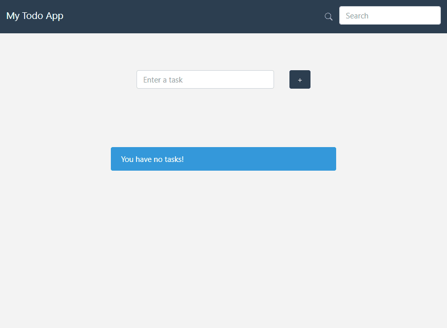
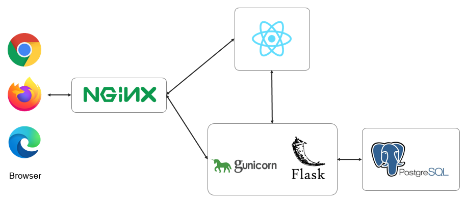

# Simple ToDo Web App with React and Flask

This is a simple ToDo web application using React as frontend and Flask/PostgreSQL as backend Rest API provider.



## Diagram


Four Docker containers are used to run this application.

- Nginx (as a reverse proxy)
- React with Nginx
- Gunicorn + Flask
- PostgreSQL

## Usage
### Prerequisite
- docker
- docker-compose

### Run the app
```bash
$ git clone git@github.com:mmurayama/todo-react-flask-pgsql.git
$ cd todo-react-flask-pgsql
$ docker-compose up --build
$ docker exec -it todo-app bash
$ python manage.py db migrate
$ python manage.py db upgrade
```
Open a browser and go to http://localhost

## License
MIT License